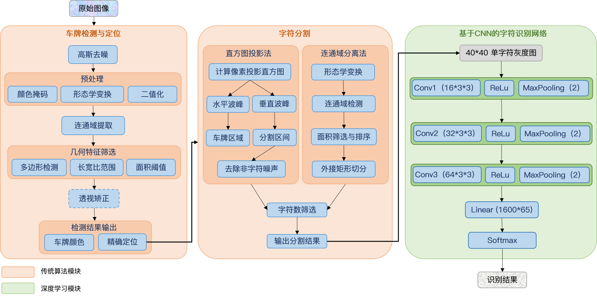
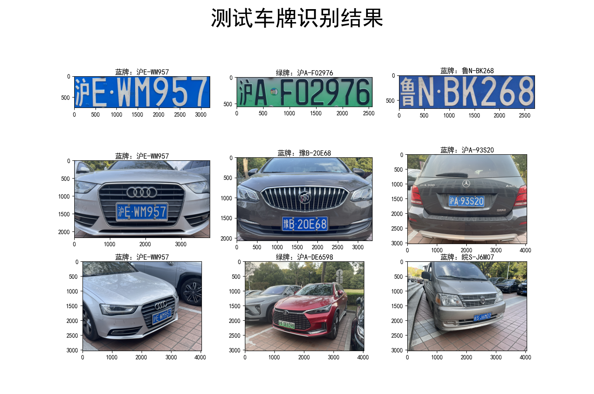

# License Plate Recognition
Course project of SJTU AI4701: Computer Vision, 2023 spring

本项目是上海交通大学计算机视觉课程项目。

### 项目任务：
本项目需要设计算法完成对给定图像中车牌位置的检测，进而识别车牌号（包括中文部分），并通过恰当的方式对检测过程以及识别结果进行可视化。给定的测试样本被划分为三个难度等级，其中 easy 和 medium 难度图片的车牌均正对相机，区别在于车牌是否已经从环境中提取，difficult 难度提供的车牌则与相机有倾角，贴近实际场景。

### 算法框架：
#### 传统算法与神经网络融合的车牌视觉识别


### 结果展示：


### 文件说明：
`main.py` 程序主入口

`detect.py` 车牌检测与定位

`recognize.py` 车牌字符的识别

`dataset.py` 数据集的构建与划分

`model.py` 定义CNN模型

`train.py` 训练网络

另外，`pretrained`下保存预训练的模型权重，`VehicleLicense`下存放训练数据，`resources`包含三个等级的九张测试图片，`test`下存放额外测试样本。

### 运行：
- 直接复现报告结果
```
python main.py
```
- 自行训练
```
python train.py
```
可调参数及默认值：`--train_ratio 0.85 --num_epochs 100 --batch_size 32 --lr 2e-4 --wd 5e-4 --lr_period 10 --lr_decay 0.95`

### Reference
[1] https://www.guyuehome.com/13863

[2] https://zhuanlan.zhihu.com/p/102203294

[3] https://blog.csdn.net/qq_44032245/article/details/94772746?spm=1001.2014.3001.5502

[4] VehicleLicense 车牌识别数据集: https://aistudio.baidu.com/aistudio/datasetdetail/56280

[5] https://github.com/Rhyam/SJTU-AU335-Computer-Vision/tree/main/project